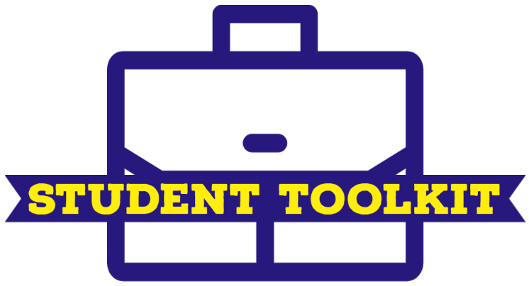

<!-- Improved compatibility of ⬆️ back to top link: See: https://github.com/othneildrew/Best-README-Template/pull/73 -->

<a name="readme-top"></a>

<!--
*** Thanks for checking out the Best-README-Template. If you have a suggestion
*** that would make this better, please fork the repo and create a pull request
*** or simply open an issue with the tag "enhancement".
*** Don't forget to give the project a star!
*** Thanks again! Now go create something AMAZING! :D
-->

<!-- PROJECT SHIELDS -->
<!--
*** I'm using markdown "reference style" links for readability.
*** Reference links are enclosed in brackets [ ] instead of parentheses ( ).
*** See the bottom of this document for the declaration of the reference variables
*** for contributors-url, forks-url, etc. This is an optional, concise syntax you may use.
*** https://www.markdownguide.org/basic-syntax/#reference-style-links
-->

[![Contributors][contributors-shield]][contributors-url]
[![Forks][forks-shield]][forks-url]
[![Stargazers][stars-shield]][stars-url]
[![Issues][issues-shield]][issues-url]
[![MIT License][license-shield]][license-url]
[![LinkedIn][linkedin-shield]][linkedin-url]

<!-- PROJECT LOGO -->
<br />
<div align="center">
  <a href="">
    
  </a>

<h3 align="center">Student Toolkit</h3>

  <p align="center">
    A toolkit for university student that can help then in many ways
    <br /> 
    <!-- <a href="https://github.com/Shadow-Chaser/student-toolkit"><strong>Explore the docs »</strong></a> -->
    <br />
    <br />
    <a href="https://studenttoolkit.netlify.app/">View Demo</a>
    ·
    <a href="https://github.com/Shadow-Chaser/student-toolkit/issues">Report Bug</a>
    ·
    <a href="https://github.com/Shadow-Chaser/student-toolkit/issues">Request Feature</a>
  </p>
</div>

<!-- TABLE OF CONTENTS -->
<details>
  <summary>📔 Table of Contents</summary>
  <ol>
    <li>
      <a href="#about-the-project">About The Project</a>
      <ul>
        <li><a href="#built-with">Built With</a></li>
      </ul>
    </li>
    <li>
      <a href="#getting-started">Getting Started</a>
      <ul>
        <li><a href="#prerequisites">Prerequisites</a></li>
        <li><a href="#installation">Installation</a></li>
      </ul>
    </li>
    <!-- <li><a href="#usage">Usage</a></li> -->
    <li><a href="#roadmap">Roadmap</a></li>
    <li><a href="#contributing">Contributing</a></li>
    <li><a href="#license">License</a></li>
    <li><a href="#contact">Contact</a></li>
    <li><a href="#acknowledgments">Acknowledgments</a></li>
  </ol>
</details>

<!-- ABOUT THE PROJECT -->
<br />
<a name="about-the-project"></a>

## 🌟 About The Project

### 📷 Screenshots

<br />

[![Product Name Screen Shot][product-screenshot]](https://i.ibb.co/yPnWDXB/landing.png)

A student have to perform various tasks every day. It is a very simple approach to solve some tiny problem make student a little bit easier.

<p align="right">( <a href="#readme-top">⬆️ back to top</a> )</p>

<a name="built-with"></a>

### 👾 Built With

- [![React][react.js]][react-url]
<!-- - [![Bootstrap][bootstrap.com]][bootstrap-url] -->

<p align="right">( <a href="#readme-top">⬆️ back to top</a> )</p>

<!-- GETTING STARTED -->

<a name="getting-started"></a>

## 🧰 Getting Started

To get a local copy up and running follow these simple example steps.

<a name="prerequisites"></a>

### 🎖️ Prerequisites

This is an example of how to list things you need to use the software and how to install them.

- yarn
  ```sh
  npm install --global yarn
  ```

<a name="installation"></a>

### ⚙️ Installation

<!-- 1. Get a free API Key at [https://example.com](https://example.com) -->

1. Clone the repo
   ```sh
   git clone https://github.com/Shadow-Chaser/student-toolkit.git
   ```
2. Install YARN packages
   ```sh
   yarn install
   ```
3. Run locally
   ```sh
   yarn start
   ```
   <!-- 4. Enter your API in `config.js`
      ```js
      const API_KEY = "ENTER YOUR API";
      ``` -->

<p align="right">( <a href="#readme-top">⬆️ back to top</a> )</p>

<!-- USAGE EXAMPLES -->

<!-- <a name="usage"></a>

## 👀 Usage

Use this space to show useful examples of how a project can be used. Additional screenshots, code examples and demos work well in this space. You may also link to more resources.

_For more examples, please refer to the [Documentation](https://example.com)_

<p align="right">( <a href="#readme-top">⬆️ back to top</a> )</p> -->

<!-- ROADMAP -->

<a name="roadmap"></a>

## 🧭 Roadmap

- [x] Basic Cover Builder
- [ ] Home Page
- [ ] Various Templates of Cover Builder
- [ ] Will Continue...

See the [open issues](https://github.com/Shadow-Chaser/student-toolkit/issues) for a full list of proposed features (and known issues).

<p align="right">( <a href="#readme-top">⬆️ back to top</a> )</p>

<!-- CONTRIBUTING -->

<a name="contributing"></a>

## 👋 Contributing

Contributions are what make the open source community such an amazing place to learn, inspire, and create. Any contributions you make are **greatly appreciated**.

If you have a suggestion that would make this better, please fork the repo and create a pull request. You can also simply open an issue with the tag "enhancement".
Don't forget to give the project a star! Thanks again!

1. Fork the Project
2. Create your Feature Branch (`git checkout -b feature/AmazingFeature`)
3. Commit your Changes (`git commit -m 'Add some AmazingFeature'`)
4. Push to the Branch (`git push origin feature/AmazingFeature`)
5. Open a Pull Request

<p align="right">( <a href="#readme-top">⬆️ back to top</a> )</p>

<!-- LICENSE -->

## ⚠️ License

<a name="license"></a>
[MIT](https://opensource.org/licenses/MIT)
<br/>
See [ `LICENSE`](https://github.com/Shadow-Chaser/student-toolkit/blob/main/LICENSE) for more information.

<p align="right">( <a href="#readme-top">⬆️ back to top</a> )</p>

<!-- CONTACT -->

<a name="contact"></a>

## 🤝 Contact

Ashab Hussan - [@AshabHussan](https://twitter.com/AshabHussan) - ashabhtanim@gmail.com

Project Link: [https://github.com/Shadow-Chaser/student-toolkit](https://github.com/Shadow-Chaser/student-toolkit)

<p align="right">( <a href="#readme-top">⬆️ back to top</a> )</p>

<!-- ACKNOWLEDGMENTS -->

<a name="acknowledgments"></a>


<p align="right">( <a href="#readme-top">⬆️ back to top</a> )</p>

<!-- MARKDOWN LINKS & IMAGES -->
<!-- https://www.markdownguide.org/basic-syntax/#reference-style-links -->

[contributors-shield]: https://img.shields.io/github/contributors/Shadow-Chaser/student-toolkit.svg?style=for-the-badge
[contributors-url]: https://github.com/Shadow-Chaser/student-toolkit/graphs/contributors
[forks-shield]: https://img.shields.io/github/forks/Shadow-Chaser/student-toolkit.svg?style=for-the-badge
[forks-url]: https://github.com/Shadow-Chaser/student-toolkit/network/members
[stars-shield]: https://img.shields.io/github/stars/Shadow-Chaser/student-toolkit.svg?style=for-the-badge
[stars-url]: https://github.com/Shadow-Chaser/student-toolkit/stargazers
[issues-shield]: https://img.shields.io/github/issues/Shadow-Chaser/student-toolkit.svg?style=for-the-badge
[issues-url]: https://github.com/Shadow-Chaser/student-toolkit/issues
[license-shield]: https://img.shields.io/github/license/Shadow-Chaser/student-toolkit.svg?style=for-the-badge
[license-url]: https://github.com/Shadow-Chaser/student-toolkit/blob/master/LICENSE.txt
[linkedin-shield]: https://img.shields.io/badge/-LinkedIn-black.svg?style=for-the-badge&logo=linkedin&colorB=555
[linkedin-url]: https://linkedin.com/in/ashabhussan
[product-screenshot]: https://i.ibb.co/yPnWDXB/landing.png
[next.js]: https://img.shields.io/badge/next.js-000000?style=for-the-badge&logo=nextdotjs&logoColor=white
[next-url]: https://nextjs.org/
[react.js]: https://img.shields.io/badge/React-20232A?style=for-the-badge&logo=react&logoColor=61DAFB
[react-url]: https://reactjs.org/
[vue.js]: https://img.shields.io/badge/Vue.js-35495E?style=for-the-badge&logo=vuedotjs&logoColor=4FC08D
[vue-url]: https://vuejs.org/
[angular.io]: https://img.shields.io/badge/Angular-DD0031?style=for-the-badge&logo=angular&logoColor=white
[angular-url]: https://angular.io/
[svelte.dev]: https://img.shields.io/badge/Svelte-4A4A55?style=for-the-badge&logo=svelte&logoColor=FF3E00
[svelte-url]: https://svelte.dev/
[laravel.com]: https://img.shields.io/badge/Laravel-FF2D20?style=for-the-badge&logo=laravel&logoColor=white
[laravel-url]: https://laravel.com
[bootstrap.com]: https://img.shields.io/badge/Bootstrap-563D7C?style=for-the-badge&logo=bootstrap&logoColor=white
[bootstrap-url]: https://getbootstrap.com
[jquery.com]: https://img.shields.io/badge/jQuery-0769AD?style=for-the-badge&logo=jquery&logoColor=white
[jquery-url]: https://jquery.com
